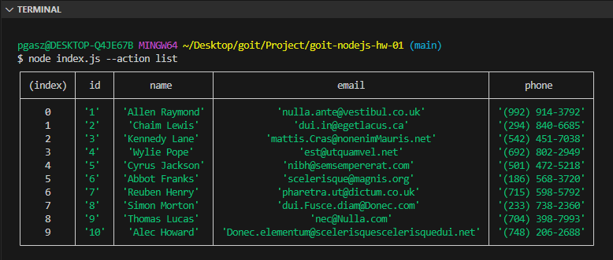
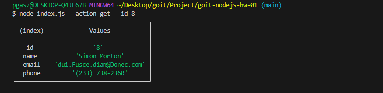
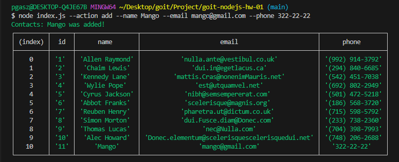
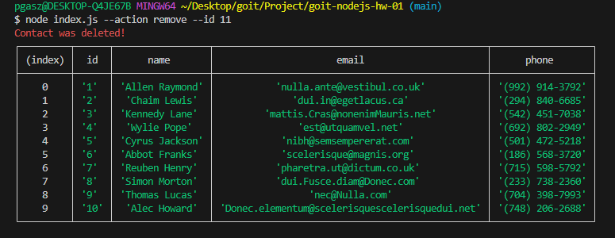

# goit-nodejs-hw-01

## View the entire contact list as a table

```
node index.js --action list
```



## Reading a contact by id

```
node index.js --action get --id 8
```



## Adding a contact

```
node index.js --action add --name Mango --email mango@gmail.com --phone 322-22-22
```



## Delete a contact

```
node index.js --action remove --id 11
```


